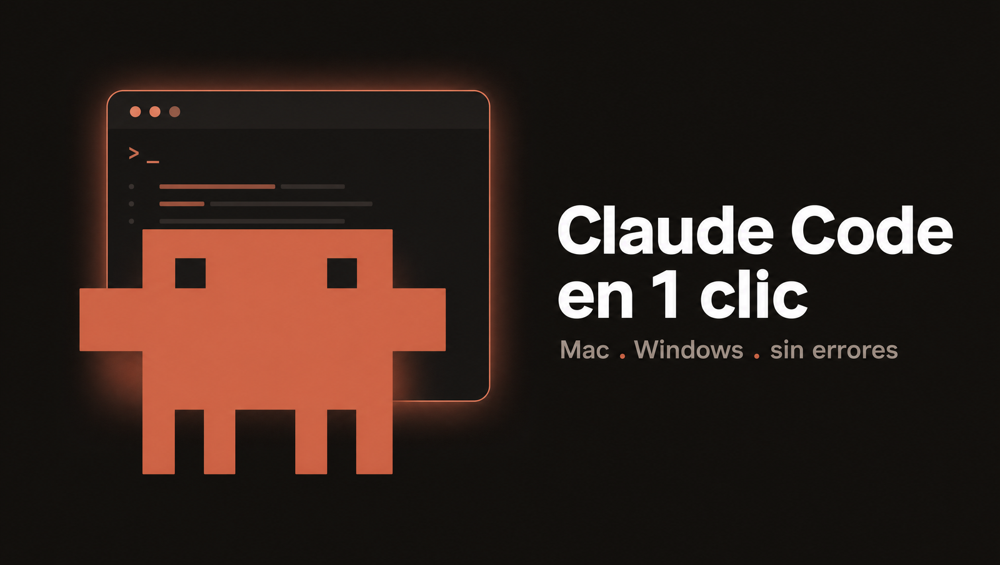
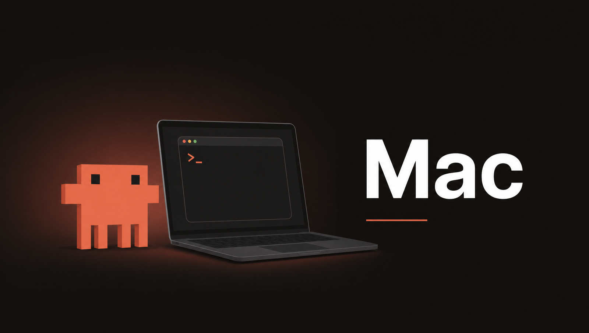
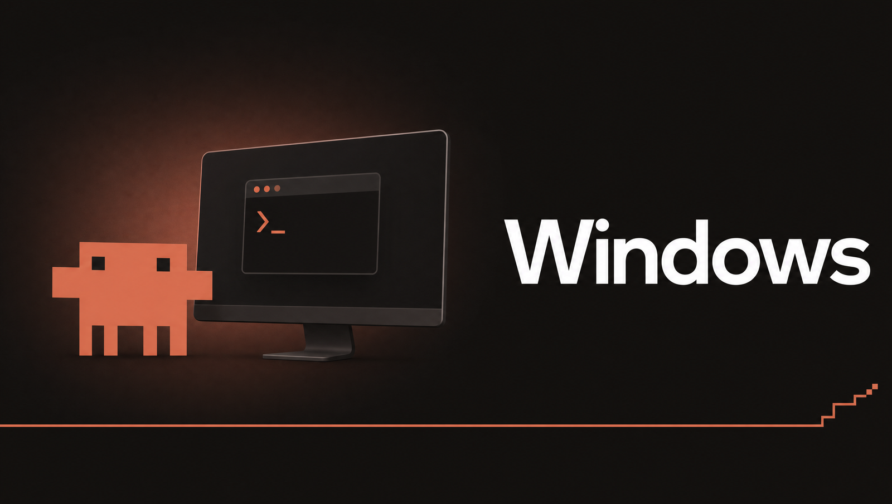

<p align="center">
  
</p>

# Claude Code en 1 clic 🚀

Instala **Claude Code** correctamente y deja un ícono **"Claude Terminal"** en tu Escritorio.
Sin saber programar. Hecho para evitar los errores típicos de instalación (el clásico
`claude: command not found`, problemas de PATH, permisos, etc.).

<p align="center">
  <a href="https://github.com/Hainrixz/claude-cmd/releases/latest"><b>📥 Descarga directa — última versión</b></a>
</p>

---

## ✅ Antes de empezar

- Necesitas una cuenta **Claude Pro, Max, Team o Enterprise** (el plan gratis **no** incluye Claude Code).
- **Mac:** macOS 13 o superior. · **Windows:** Windows 10 (1809) o superior, 64 bits.
- Conexión a internet.

---

## 🍎 Mac

<p align="center"></p>

### Método 1 — Recomendado (fácil y **sin avisos de seguridad**)

Esta es la forma más simple. No descarga ningún archivo, así que macOS **no muestra ninguna advertencia**.

1. Abre la app **Terminal**: pulsa `⌘ + Espacio`, escribe `Terminal` y pulsa `Enter`.
2. Copia y pega este comando, y pulsa `Enter`:

```bash
curl -fsSL https://raw.githubusercontent.com/Hainrixz/claude-cmd/main/install-mac.command | bash
```

3. Cuando termine, busca **"Claude Terminal"** en tu Escritorio y haz doble clic. ✅

> 🔒 **¿Es seguro?** Sí. El instalador es de código abierto y puedes leerlo antes de
> ejecutarlo aquí: **[`install-mac.command`](./install-mac.command)**. No instala nada oculto.

---

### Método 2 — Descargar el archivo (alternativa)

Si prefieres descargar el instalador y hacer doble clic, ten en cuenta que macOS mostrará
un **aviso de seguridad** la primera vez (*"macOS no puede comprobar si install-mac.command
contiene software malicioso"*). Es normal en cualquier app gratuita que no paga la firma de
Apple — **no es un virus**. Así lo saltas:

1. Descarga **[`install-mac.command`](https://raw.githubusercontent.com/Hainrixz/claude-cmd/main/install-mac.command)**
   y haz **doble clic**. Cuando aparezca el aviso, pulsa **Listo** (no "Mover a la papelera").
2. Abre **Ajustes del Sistema → Privacidad y Seguridad**.
3. Baja hasta la sección **Seguridad**: verás *"install-mac.command" se bloqueó…* con el
   botón **Abrir de todos modos**. Púlsalo.
4. Autentícate con **Touch ID** o tu **contraseña de administrador** y confirma **Abrir**. (Solo la primera vez.)

> ⚠️ **El truco de "clic derecho → Abrir" ya NO funciona.** Apple lo eliminó en macOS 15
> Sequoia (2024) y sigue eliminado en Tahoe (26). Usa los pasos de arriba.
>
> ⏱️ **macOS Tahoe (26):** pulsa *Abrir de todos modos* dentro de la **primera hora** tras
> ver el aviso. Si pasó más tiempo, vuelve a hacer doble clic para que reaparezca.

> **Atajo por Terminal:** si no quieres tocar Ajustes, quita la marca de cuarentena del
> archivo descargado y el doble clic funcionará sin avisos:
> ```bash
> xattr -dr com.apple.quarantine ~/Downloads/install-mac.command
> ```

---

## 🪟 Windows

<p align="center"></p>

### Opción A — Descargar el archivo (recomendado)

1. Descarga **[`install-windows.bat`](https://raw.githubusercontent.com/Hainrixz/claude-cmd/main/install-windows.bat)**.
2. Haz **doble clic** en el archivo.
3. Si aparece **SmartScreen** ("Windows protegió su PC"):
   **"Más información" → "Ejecutar de todas formas"**.

### Opción B — Un solo comando

Abre **PowerShell** (botón Inicio → escribe "PowerShell" → Enter), pega esto y pulsa Enter:

```powershell
irm https://raw.githubusercontent.com/Hainrixz/claude-cmd/main/install-windows.ps1 | iex
```

Cuando termine, busca **"Claude Terminal"** en tu Escritorio y haz doble clic. ✅

---

## 📂 Elige la carpeta al abrir

Cada vez que abres **"Claude Terminal"**, te pregunta en qué carpeta quieres trabajar:

```
  ¿En qué carpeta quieres abrir Claude Code? 📂

   [Enter]  Tu carpeta personal  (por defecto)
       1    Escritorio
       2    Documentos
       3    Descargas
       4    Elegir una carpeta…  (se abre una ventana para buscarla)
       5    Escribir o arrastrar una carpeta
```

Pulsa **Enter** para tu carpeta personal (lo de siempre), elige una carpeta común, abre un
**explorador** para buscarla, o escribe/arrastra una ruta. Recuerda la **última carpeta** que
usaste para ofrecértela la próxima vez. Funciona igual en Mac y Windows.

---

## ▶️ La primera vez

Al abrir Claude Code, se abrirá tu **navegador** para iniciar sesión. Inicia sesión con tu
cuenta de Anthropic y vuelve a la ventana de la terminal. ¡Listo!

---

## ⚙️ Opciones (avanzado)

- **Modo avanzado (saltar permisos, `--dangerously-skip-permissions`):** desactivado por defecto.
  Con él, Claude ejecuta acciones **sin pedirte confirmación** — actívalo solo si sabes lo que haces.
  - Al instalar por **doble clic**, el instalador te pregunta si quieres activarlo.
  - Al instalar por **comando**, actívalo así:
    - Mac: `CLAUDE_CMD_SKIP_PERMS=1 bash <(curl -fsSL https://raw.githubusercontent.com/Hainrixz/claude-cmd/main/install-mac.command)`
    - Windows: `$env:CLAUDE_CMD_SKIP_PERMS=1; irm https://raw.githubusercontent.com/Hainrixz/claude-cmd/main/install-windows.ps1 | iex`

---

## 🆘 Solución a problemas comunes

| Síntoma (lo que ves) | Por qué pasa | Solución |
|---|---|---|
| `command not found: claude` / `'claude' no se reconoce` | El PATH no se recargó | **Cierra y abre** una terminal nueva. Mac: o ejecuta `source ~/.zshrc`. (El ícono del Escritorio funciona igual.) |
| (Mac) "macOS no puede comprobar si install-mac.command contiene software malicioso" / "no se puede abrir" | Gatekeeper en un archivo descargado y sin firmar (normal en software gratuito) | **Mejor:** usa el **Método 1** (comando de Terminal), que no genera el aviso. **O bien:** Ajustes del Sistema → Privacidad y Seguridad → sección Seguridad → **Abrir de todos modos** (en Tahoe, dentro de 1 hora). **O por Terminal:** `xattr -dr com.apple.quarantine ~/Downloads/install-mac.command`. ⚠️ El viejo clic derecho → Abrir **ya no funciona** desde macOS Sequoia. El ícono del Escritorio no tiene este problema (se crea en tu Mac). |
| (Mac) "no tiene privilegios de acceso" al doble clic | El archivo descargado perdió el permiso de ejecución | Usa el **Método 1** (el comando de Terminal), o ejecuta `chmod +x ~/Downloads/install-mac.command` y reintenta. |
| (Windows) `irm no se reconoce` | Estás en CMD, no en PowerShell | Abre **PowerShell** (el prompt empieza con `PS C:\>`). |
| (Windows) `bash no se reconoce` | Pegaste el comando de Mac en Windows | Usa el comando de Windows (`irm … | iex`). |
| (Windows) "no se pueden ejecutar scripts / running scripts is disabled" | Política de ejecución restringida | `Set-ExecutionPolicy -Scope Process Bypass`, luego repite el comando. (El `.bat` ya lo evita.) |
| (Windows) instala pero falta `claude.exe`, o "el proceso no puede acceder al archivo …\.claude\downloads" | Antivirus bloqueó la descarga | `Remove-Item -Recurse -Force "$env:USERPROFILE\.claude\downloads"`, añade una exclusión para `%USERPROFILE%\.local\bin`, y reintenta. |
| (Windows) "does not support 32-bit Windows" | Abriste PowerShell (x86) | Abre **"Windows PowerShell"** normal, no la versión (x86). |
| Versión vieja tras instalar / avisos de instalaciones duplicadas | Hay varias instalaciones (npm + nativa) | `npm uninstall -g @anthropic-ai/claude-code`, borra `~/.claude/local`, reinstala. |
| Pide iniciar sesión y dice que no tienes acceso | Plan gratis | Claude Code requiere **Pro / Max / Team / Enterprise**. |
| Quieres un diagnóstico | — | Ejecuta `claude doctor` en una terminal. |

---

## 🗑️ Desinstalar

- **Mac:**
  ```bash
  rm -f ~/.local/bin/claude && rm -rf ~/.local/share/claude
  rm -f ~/Desktop/"Claude Terminal.command"
  ```
- **Windows:**
  ```powershell
  Remove-Item -Force "$env:USERPROFILE\.local\bin\claude.exe"
  Remove-Item -Force "$([Environment]::GetFolderPath('Desktop'))\Claude Terminal.lnk"
  ```
  (Config de usuario opcional: `~/.claude` y `~/.claude.json`.)

---

## ¿Cómo funciona?

Estos scripts usan el **instalador nativo oficial de Anthropic** por debajo
(`https://claude.ai/install.sh` en Mac, `https://claude.ai/install.ps1` en Windows), que instala
Claude Code por-usuario, sin Node ni permisos de administrador. Encima de eso:
verifican la instalación, arreglan el PATH si hace falta, y **generan localmente** el lanzador del
Escritorio (por eso no sufre de Gatekeeper/SmartScreen). El lanzador llama al binario por su **ruta
absoluta**, así funciona de inmediato sin reiniciar la terminal. Además, al acceso directo se le pone
el ícono de la **mascota** 🟧 (embebido en los instaladores como base64; en Mac vía `osascript`+
NSWorkspace, en Windows como `.ico` en `%LOCALAPPDATA%\claude-cmd`). Si el ícono no se pudiera
aplicar, el lanzador funciona igual.

## 🎨 Personalizar / regenerar el ícono

El ícono se genera desde `assets/mascot-source.png` con herramientas locales (Python + Pillow):

```bash
# 1) Genera claude-terminal.png (.icns no hace falta) y claude-terminal.ico + sus .b64
python3 assets/make-icons.py assets/mascot-source.png assets --final A
# 2) Inyecta los base64 en install-mac.command e install-windows.ps1
python3 assets/embed-icons.py
```

`--final A` usa fondo transparente; `B` (verde) y `C` (oscuro de marca) también están disponibles.

## Licencia

[MIT](LICENSE).
